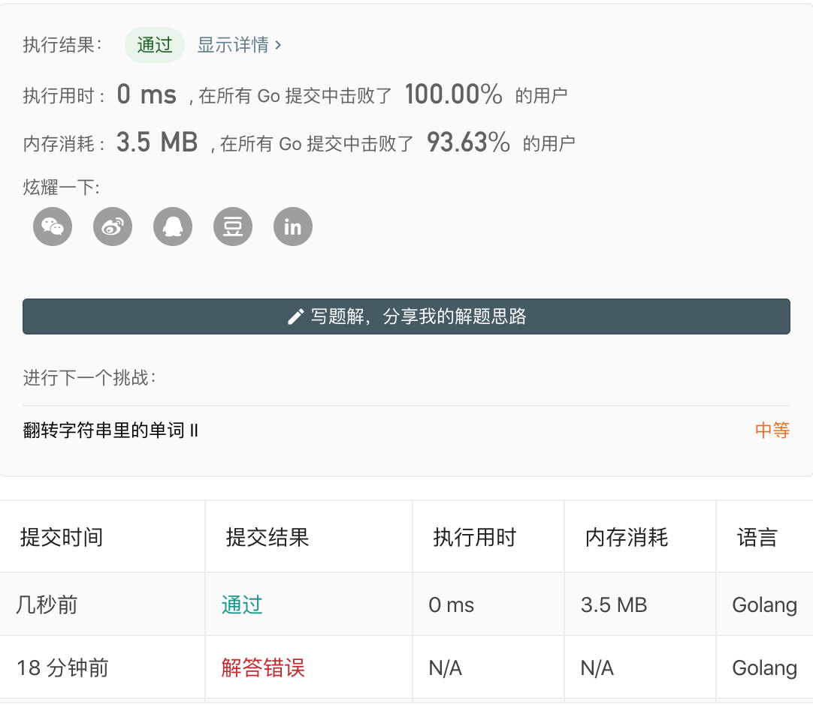

# Reverse string

ID: `151`  
Name: `reverse-words-in-a-string`  
Url: [reverse-words-in-a-string](https://leetcode-cn.com/problems/reverse-words-in-a-string/)  
Pass: `2020-02-05`

## Description

给定一个字符串，逐个翻转字符串中的每个单词。

示例 1：

```
输入: "the sky is blue"
输出: "blue is sky the"
```

示例 2：

```
输入: "  hello world!  "
输出: "world! hello"
解释: 输入字符串可以在前面或者后面包含多余的空格，但是反转后的字符不能包括。
```

示例 3：

```
输入: "a good   example"
输出: "example good a"
解释: 如果两个单词间有多余的空格，将反转后单词间的空格减少到只含一个。
```

说明：

> 无空格字符构成一个单词。
> 输入字符串可以在前面或者后面包含多余的空格，但是反转后的字符不能包括。
> 如果两个单词间有多余的空格，将反转后单词间的空格减少到只含一个。
 

进阶：

请选用 C 语言的用户尝试使用 O(1) 额外空间复杂度的原地解法。

## Solution

题解来自: [Back Clean Java two-pointers solution (no trim( ), no split( ), no StringBuilder)](https://leetcode.com/problems/reverse-words-in-a-string/discuss/47720/Clean-Java-two-pointers-solution-(no-trim(-)-no-split(-)-no-StringBuilder)

## Record



## Copyright

来源：力扣（LeetCode）  
链接：[https://leetcode-cn.com/problems/reverse-words-in-a-string](https://leetcode-cn.com/problems/reverse-words-in-a-string)  
