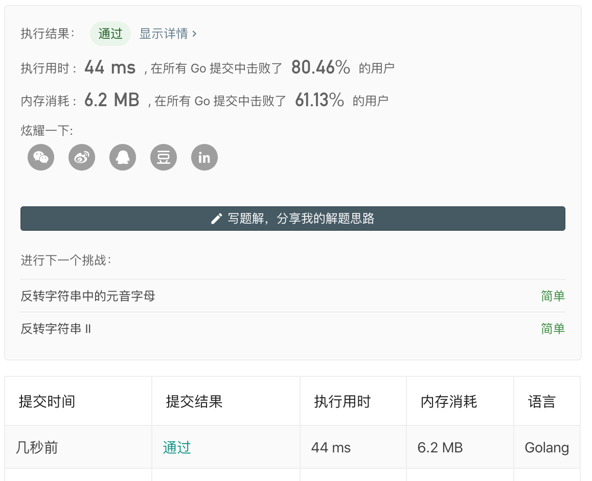

# Reverse string

ID: `344`  
Name: `reverse-string`  
Url: [reverse-string](https://leetcode-cn.com/problems/reverse-string/)  
Pass: `2020-02-05`

## Description

编写一个函数，其作用是将输入的字符串反转过来。输入字符串以字符数组 char[] 的形式给出。

不要给另外的数组分配额外的空间，你必须原地修改输入数组、使用 O(1) 的额外空间解决这一问题。

你可以假设数组中的所有字符都是 ASCII 码表中的可打印字符。

示例 1：

```
输入：["h","e","l","l","o"]
输出：["o","l","l","e","h"]
```

示例 2：

```
输入：["H","a","n","n","a","h"]
输出：["h","a","n","n","a","H"]
```

## Benchmark

```bash
$ go test -test.bench=".*" -count=5 
goos: darwin
goarch: amd64
Benchmark_reverseString-4       100000000               12.1 ns/op
Benchmark_reverseString-4       94788938                12.3 ns/op
Benchmark_reverseString-4       100000000               12.2 ns/op
Benchmark_reverseString-4       100000000               12.3 ns/op
Benchmark_reverseString-4       89758803                13.6 ns/op
Benchmark_reverseString2-4      100000000               10.2 ns/op
Benchmark_reverseString2-4      100000000               10.9 ns/op
Benchmark_reverseString2-4      100000000               10.1 ns/op
Benchmark_reverseString2-4      100000000               10.3 ns/op
Benchmark_reverseString2-4      96893512                10.7 ns/op
PASS
ok      _/Users/Shared/git/dingdayu/leetcode/algorithms/344     11.698s
```

## Record



## Copyright

来源：力扣（LeetCode）  
链接：[https://leetcode-cn.com/problems/reverse-string](https://leetcode-cn.com/problems/reverse-string)  
